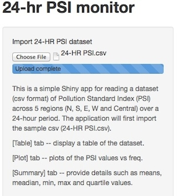
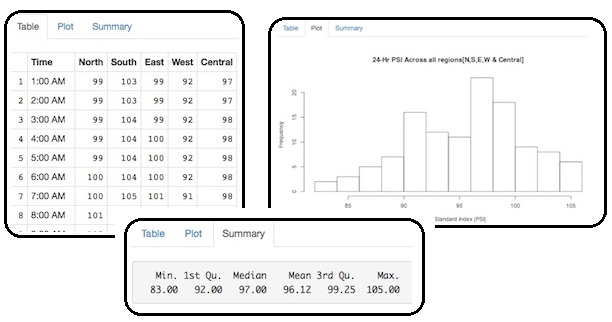

## Rationale for this PSI app 
---
This app was conceived based on need for sensing the state of pollution of a country over a 24-hr period using the PSI Indexes which are derived by pollutant sensors located across 5 regions(North, South, East West and Central).   For simplicity of this assignment, only the derived PSI index over a 24-hr period will be used.  

Prior to this app, in order to have a high level sensing on the air pollution for the country, the users have to do manual calculations and recordings on:

1. the nummber of occurrences    
2. the min, max, median and quatile levelsof the PSI values over a 24-hr period.

OBJECTIVE of this PSI app 
=========================
The app aims to minimise user interventions and automate the two manual tasks stated above in order toe enable users to focus on the analysis of the underlying data patterns and thus to formulate better business decisions in handling any impending pollution situation.

---  

## Key Functionalities of the PSI App
---
The app provides a TWO STEP approach for the users to have a rapid high level sense of the pollution situation:

STEP 1
======
User needs only to upload the 24-hr PSI dataset to the website on the top left hand panel of the screen.  Once uploded, the app will compute and provide the necessary visuals immediately for the user to perform analysis/observations.  A blue status bar will indicate the progress of uploading.  Once the upload is completed, the status bar will indicate an "Upload complete" message.

STEP 2
======
On the main screen of the App there are 3 Tabs which the user can 'click'to access the info:     
a. [Table] tab   -- the default view and display a table of the uploaded dataset.   
b. [Plot] tab    -- plots of the PSI values and the corresponding frequency of occurences.      
                    For users to sense whether the pollutions are building up over a 24-hr period.                     
c. [Summary] tab -- provide the means, meadian, min, max and quartile values.       
                    There info are neede by the user for determining trend thresholds has been breached,etc.

---  

## Screen Shots of the PSI App 
---
The following are the screenshots (from left to right) from the app:    
a. Upload -- User can import the 24-HR PSI dataset by clicking on the [Choose File] button      
b. Table  -- The view of the 24-hr PSI dataset after uploading    
c. Plot   -- The graphical view on the PSI values across 5 regions and occurences    
d. Summary-- (bottom) The various data asociated with the PSI dataset    

---  

## Technical Info on the PSI App
---
The files needed to run this app are:   
a.  ui.R   
b.  server.R and    
c.  24-HR PSI.csv (the sample dataset to input after the app is launch)

I have published on the Shiny portal so that could test the PSI app immediately. You may want to 'test drive' this app by going to the following URL: https://dreamz.shinyapps.io/PSIData/    
and remember to download the (c) the sample 24-HR PSI.csv dataset.    
Have fun!

Should you want to explore my codes, you may download them from my github:  
https://github.com/jansenling/PSIData.git   
Do remeber to provide me any inputs so that I can continue to improve my basic programming skills.

Thanks in advance!

Ling kok Heng (Jansen)
